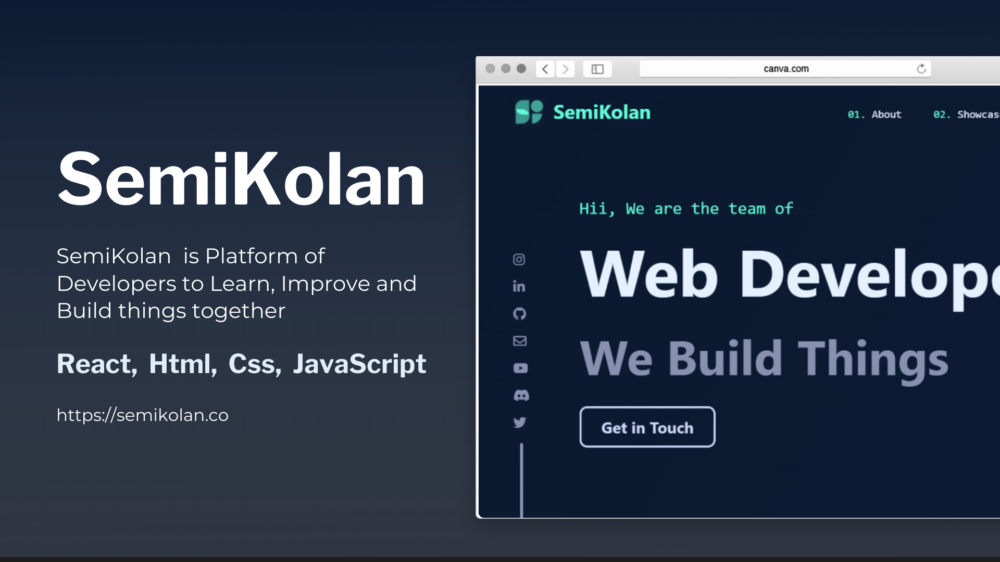

## About SemiKolan

SemiKolan, as a starter, is a group of friends, who love to build things and help others.

Semikolan is also a platform for like minded learners, developers and Enthusiasts to learn, connect, create great connections and work on great projects among themselves and for the community. The Semikolan team is a group of Self Learners, Innovative Minds and Tech Enthusiasts passionate about building [Technical Stuffs](https://semikolan.co/initiatives).

We encourage anyone with an aptitute for learning to [join](https://semikolan.co/join) our community and join our mission to code for the better.

### Table of Contents
- [Installation Guide](#installation-guide)
- [File Structure](#file-structures) (will be added soon)
- [Contributing Guidelines](CONTRIBUTING.md)
- [Join Us](#join-us)
- [Color Reference](#color-reference)
- [Contributers](#code-contributers)


## Installation Guide

Before Any of the following steps, make sure you have installed the Nodejs and Git in your system. You can simply install Nodejs from [here](https://nodejs.org/en/) and Git from [here](https://git-scm.com/downloads)
Now you can follow the steps below to install Instalyzer.
Fork the [Github Repository](https://github.com/semikolan-co/semikolan-react) and clone it to your local machine. You can clone using a simple command like this:
```sh
git clone https://github.com/<your_username>/semikolan-react.git 
``` 

Then move to the root directory of the cloned repository. You can do this by typing the following command:
```sh
cd semikolan-react
```

Now run the following command to install the dependencies:
```sh
npm install
```
Now you can run the following command to start the server:
```sh
npm start
```
Congratulations! You have successfully installed SemiKolan Website. Your server is running on localhost:3000

## Join Us

Be a part of the SemiKolan Developer's Community by joining our [Discord Server](https://discord.semikolan.co). Here you can discuss about the project or ask any other queries and there will be a lot of folks to help

[](https://discord.semikolan.co)


## Color Reference

| Color          | Hex                                                                |
| -------------- | ------------------------------------------------------------------ |
| Navy           |  `#0a192f` |
| Light Navy     |  `#112240` |
| Lightest Navy  |  `#233554` |
| Slate          |  `#8892b0` |
| Light Slate    |  `#a8b2d1` |
| Lightest Slate |  `#ccd6f6` |
| White          |  `#e6f1ff` |
| Green          |  `#64ffda` |


## Code Contributers

This project exists thanks to all the people who contribute. [[Contribute](CONTRIBUTING.md)].

<a href="https://github.com/semikolan-co/semikolan-react/graphs/contributors">
  
</a>
